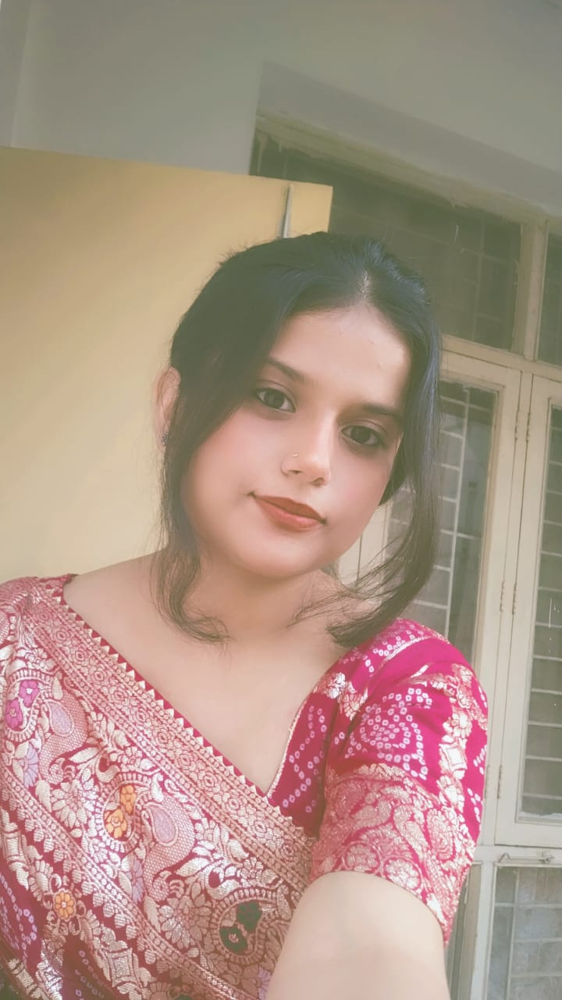

<!DOCTYPE html>
<html lang="en">
<head>
  <meta charset="UTF-8" />
  <meta name="viewport" content="width=device-width, initial-scale=1.0"/>
  <title>Happy Birthday Baabi 🎉</title>
  
</head>
<body>
  <h1>🎉 Happy Birthday Baabi 🎉</h1>
  <h2>To My Pasandida Aurat 💖</h2>
  
❤❤❤

  <!-- PHOTO OF BAABI -->
  

  

    On this special day, I just want to say — you're the light of my life, the smile of my day, and the peace in my heart.  
      
    May your birthday be as beautiful, sweet, and full of love as you are.  
      
    I'm so lucky to have you in my life. I promise to always make you feel special, not just today — but every day. 🎁
  

  
I LOVE YOU A LOT

  

    Made with ❤ by your Kanu for his Pasandida Baabi
  

</body>
</html>
